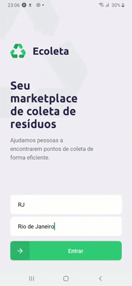

# NLW-01
Estudei a construção desse projeto durante o Next Level Week #01.

# Ecoleta App
> Aplicativo para ajudar na coleta de resíduos

> Node.js, ReactJs, React-Native

 

## Back-end

No backend foi utilizado banco de dados SQL com o SQLite e migrations para criar as "Tables", foi necessario três tabelas, 
uma para armazenas os pontos, uma para o itens e uma terceira para relacionar as duas tabelas no modelo "Muitos para Muitos",
com as respectivas Primary keys e Foreing keys para referenciar/relacionar as tabelas.

Foi apresentado o uso de rotas, métodos 'http request' (post, get, delete, put), e os parâmetros que podem ser passados (body, query, params).
Além disso, percebe-se como o uso do Knex permite mudar entre as ferramentas de banco de dados SQL, como SQLite, MySQL, MariaDB, PostgreSQL e o código continua funcionando normalmente por permitir uma linguagem unificada.

O Web Framework Express além de controlar as requisições e o acesso ao banco de dados (integrado ao knex), gerenciou as rotas do backend.

## Front-end
Mostrou-se como utilizar os 'Components' e 'states' do React para atualizar a visualização da página, e que os componentes do React podem passar 'props', para um 'chield component', permitindo envio de dados entre diversos componentes que juntos montam a página.

Também foi feita a conexão com API do IBGE para controlar a localização dos Estado e cidades.

### Estrutura MVC E RESTful API
Aprendi algumas diferenças entre a estrutura MVC (Model, View, Controller) e RESTful API, em que no MVC o backend renderiza também a parte visual, como templates, como nas Template Egines que possibilita enviar variaveis para o "html" (Jinja no caso do Flask, e Pug ou EJS no caso do Express por exemplo).
Enquanto na estrutura RESTful api, o frontend Framework cuida totalmente da parte visual, apenas recebendo dados do backend no formato JSON ou multpart/form-data no caso de enviar Files também, esses dados enviados do backend podem ser recebidos tanto na web (React) quanto no Mobile (React Native).

# Mobile
Uso do aplicativo expo para renderizar o app em desenvolvimento no celular.
Uma parte muito interessante foi como fazer a conexão com o mapa, além de filtrar quais pontos devem aparecer no mapa com base no item de coleta que o usuario selecionar.

## Apresentação

### Navegação e performance
Tanto no React quanto no React-Native se demonstra como fazer rotas entre 'Components' e melhorar a performance da navegação sem precisar recarregar as paginas inteiras.

### Na última aula foi tratado sobre o envio de arquivos (para a imagem do ponto de coleta) e como validar dados no registro desses pontos.

### Não só isso, mas também foi adquirido várias dicas, conselhos e boas práticas para construção de projetos.
Projeto apresentado pelo Diego Fernandes, CTO da Rocketseat.

[LinkedIn Felipe Nieto](https://www.linkedin.com/in/felipe-antonio-nieto-curcio-9b865116a/)
